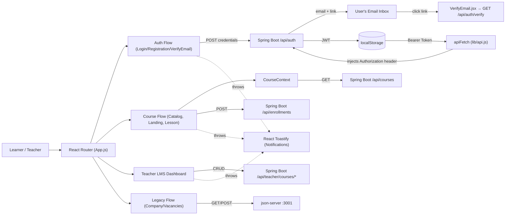
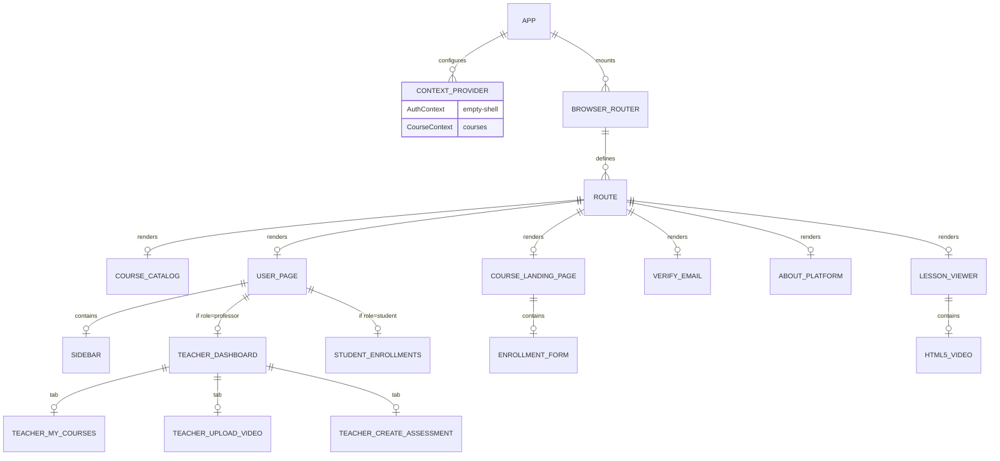

# Project Blueprint: eLearning Frontend (OYN / Jiyuu)

## Snapshot

- Repository: `oyn_front` (internally initialized as `jiyuu`)
- Audit date: `2026-04-24`
- Audit method: code inspection plus repo exploration by a delegated subagent
- Architectural style: React Single Page Application (SPA) with Context-based domain state and dual-backend integration
- Current dev environment: `npm start` (react-scripts) running on standard Webpack dev server
- Upstream Dependencies:
  - Spring Boot Backend (`http://localhost:7777`): Core eLearning domain (Auth, Courses, Lessons, Teacher LMS)
  - `json-server` (`http://localhost:3001`): Legacy domain (Gallery, Photoshoots, Vacancies) — no longer mounted in `App.js` but components still exist

## The Essence

This repository is the React frontend for a Kazakhstan-focused eLearning platform (Orda Skills). It consumes a Spring Boot backend for all core domain logic and retains legacy components for photography/recruitment features.

Current product shape:

1. Public visitors can view the landing page and the About platform page.
2. Users can register as **Student**, **Teacher (Professor)**, or **Company** with role-specific form fields.
3. Registration triggers an **email verification** flow — users land on a verification-pending screen, click the link, and are auto-logged in via `GET /api/auth/verify?token=`.
4. Authenticated learners can browse the Course Catalog and open course landing pages.
5. Learners can submit enrollment forms inline on course landing pages (no forced sign-up).
6. Enrolled students can open lesson viewer pages with embedded HTML5 video playback.
7. **Teachers** get a full LMS dashboard: create/edit/delete courses, upload video lessons, and create assessments.
8. JWT auth is handled across the entire app through the centralized `apiFetch` utility.
9. Legacy company/photographer roles can manage photoshoots and vacancies via the legacy backend.

Primary stack:

- React 19
- React Router DOM v7
- Redux Toolkit (for session user + theme state)
- React Context API (for course catalog caching)
- React Toastify (for global notifications)
- Vanilla CSS (`index.css`)

## High-Level Architecture

### Architectural Pattern

- `Pages/` contains domain-bounded route components (`CoursePage`, `LessonPage`, `UserPage`, etc.).
- `Components/` contains globally shared UI elements (`Header`, `Footer`, `Login`, `Registration`).
- `redux/` contains Redux slices (`userSlice`, `themeSlice`).
- `lib/api.js` is the **centralized HTTP client** — all Spring Boot API calls go through `apiFetch`.
- `App.js` is the composition root, mounting Context providers and all routes.

### UI / Data Flow



### Component Hierarchy Model



## Route & API Surface

| Route Path | React Component | Backing API Integrations | Purpose |
| --- | --- | --- | --- |
| `/login` | `Login.jsx` | `POST 7777/api/auth/login`, `GET 7777/api/auth/me` | Exchange credentials for JWT & populate Redux |
| `/registration` | `Registration.jsx` | `POST 7777/api/auth/register` | Role-selection (Student/Teacher/Company) + create account |
| `/verify-email` | `VerifyEmail.jsx` | `GET 7777/api/auth/verify?token=` | Email verification link handler; auto-logs in on success |
| `/` | `IndexPage.jsx` | static | Landing page |
| `/about` | `AboutPlatform.jsx` | static | Platform marketing page (stats, mission, testimonials) |
| `/courses` | `CourseCatalog.jsx` | `GET 7777/api/courses` | Grid display of available courses |
| `/courses/:slug` | `CourseLandingPage.jsx` | `GET 7777/api/courses/{slug}`, `POST 7777/api/enrollments` | Course detail and inline enrollment |
| `/courses/:courseSlug/lessons/:lessonSlug` | `LessonViewer.jsx` | `GET 7777/api/courses/{courseSlug}/lessons/{lessonSlug}` | Video playback and lesson metadata |
| `/profile/:role/:id` | `ProfileSwitch.jsx` | varies by role | Legacy role-based profile switcher |
| `/refill-balance/:id` | `RefillBalance.jsx` | legacy | Legacy balance refill (company domain) |
| `/add-vacancy` | `AddVacancy.jsx` | `3001/vacancies` | Legacy vacancy creation |
| `/all-vacancies/:id` | `Vacancies.jsx` | `3001/vacancies` | Legacy vacancy listing |
| `/edit` | `Edit.jsx` | legacy | Legacy profile edit |

### Teacher-Only API Routes (via `apiFetch`)

| Method | Endpoint | Purpose |
| --- | --- | --- |
| `GET` | `/api/teacher/courses` | List own courses (with status, lesson count) |
| `POST` | `/api/teacher/courses` | Create a new course (title, subtitle, description, locale, level, durationHours, price) |
| `PUT` | `/api/teacher/courses/:slug` | Edit course metadata (DRAFT or REJECTED only) |
| `DELETE` | `/api/teacher/courses/:slug` | Delete a DRAFT course |
| `POST` | `/api/teacher/courses/:slug/publish` | Submit course for admin review → PENDING_REVIEW |
| `POST` | `/api/teacher/courses/:slug/withdraw` | Pull course back from review → DRAFT |
| `GET` | `/api/teacher/courses/:slug/lessons` | List lessons for a course |
| `POST` | `/api/teacher/courses/:slug/lessons` | Add a video lesson (videoUrl, title, summary, durationMinutes) |

## High-Signal File Map

### Build, Bootstrap, and Config

| Path | Responsibility | Why it matters |
| --- | --- | --- |
| `package.json` | Dependencies and Scripts | Defines `react-scripts`, `react-router-dom` v7. |
| `src/index.js` | React mounting point | Wires `react-redux` Provider to the DOM root. |
| `src/App.js` | Master Router and Provider tree | Session hydration + course list fetch on mount; maps all URL paths. |
| `src/lib/api.js` | Centralized HTTP client | `apiFetch` — injects Bearer token, handles 401/403/429/204 globally. The single correct way to call the Spring Boot API. |
| `src/index.css` | Global styling | Monolith vanilla CSS handling `.course-card`, `.lms-*`, `.dashboard`, `.sidebar`, etc. |

### Core Learner Flow

| Path | Responsibility | Why it matters |
| --- | --- | --- |
| `src/Components/Login.jsx` | JWT auth acquisition | Single point of token generation and Redux `setUser` dispatch. |
| `src/Components/Registration.jsx` | Role-based account creation | Role-selection card UI; maps to backend enum (`student→STUDENT`, `professor→TEACHER`). Handles email-verification-pending state. |
| `src/Pages/VerifyEmailPage/VerifyEmail.jsx` | Email verification | Reads `?token=` param, calls `/api/auth/verify`, stores token, dispatches `setUser`, navigates to `/`. |
| `src/Pages/CoursePage/CourseCatalog.jsx` | Dynamic catalog UI | Pulls from `CourseContext` to render course cards. |
| `src/Pages/CoursePage/CourseLandingPage.jsx` | Course detail + enrollment | Bridges public viewing to backend enrollment creation via inline email form. |
| `src/Pages/LessonPage/LessonViewer.jsx` | Media consumption | Resolves `videoUrl` from the Spring Boot lesson payload for playback. |

### Teacher LMS Subsystem

| Path | Responsibility | Why it matters |
| --- | --- | --- |
| `src/Pages/UserPage/UserProfile.jsx` | Profile + dashboard root | Detects `role === "professor"` from Redux; routes to `TeacherDashboard` or student enrollment list accordingly. |
| `src/Pages/UserPage/ui/sidebar.jsx` | Role-aware navigation | Students see [My Courses, Certificates, Settings]; teachers see [Manage Courses, Settings]. |
| `src/Pages/UserPage/ui/TeacherDashboard.jsx` | LMS shell | Tab container: My Courses / Upload Video / Create Assessment. |
| `src/Pages/UserPage/ui/TeacherMyCourses.jsx` | Course CRUD UI | Full lifecycle: create → edit → publish → withdraw → delete. Inline lesson viewer with video and assessment tabs. |
| `src/Pages/UserPage/ui/TeacherUploadVideo.jsx` | Lesson upload | YouTube/Vimeo URL + duration form; live embed preview before submission. |
| `src/Pages/UserPage/ui/TeacherCreateAssessment.jsx` | Assessment creation | Creates assessment-type lessons attached to a course. |

### Legacy Subsystems

| Path | Responsibility | Why it matters |
| --- | --- | --- |
| `server.json` | Mock DB Schema | Powers `json-server` for legacy domain (galleries, vacancies). |
| `express.js` | Legacy media wrapper | Port 4000 upload handler for legacy photoshoot components. |
| `src/Pages/CompanyPage/` | Company domain | Visualizes and mutates port 3001 resources, fully detached from the eLearning context. |

## Core Business Logic Explained

### 1. Centralized API Client (`apiFetch`)

All Spring Boot calls go through `src/lib/api.js`. It:
- Reads the base URL from `process.env.REACT_APP_SPRING_API` (fallback: `http://localhost:7777`).
- Automatically injects `Authorization: Bearer <token>` from `localStorage`.
- On **401**: clears the token and redirects to `/login`.
- On **403**: reads the error body and throws a typed error with `.status = 403`.
- On **429**: throws a rate-limit error.
- On **204**: returns `null` cleanly.

This was previously a documented risk ("Missing Centralized Fetch Interceptors") — it is now resolved.

### 2. Email Verification Flow

When a user registers and the backend does not immediately return an `accessToken`, `Registration.jsx` sets `awaitingVerification = true` and renders a "Check your email" screen. The user clicks the link in their inbox, which hits `/verify-email?token=...`. `VerifyEmail.jsx` calls `GET /api/auth/verify`, stores the JWT, dispatches `setUser`, and navigates to `/`.

### 3. Role-Based Dashboard

`UserProfile.jsx` reads `user.role` from Redux. If `role === "professor"`, it renders `TeacherDashboard`. Otherwise it renders the student's enrolled course list fetched from `GET /api/enrollments?email=<user.email>`.

### 4. Teacher Course Lifecycle

Courses move through backend-enforced states:
```
DRAFT → (publish) → PENDING_REVIEW → (admin approve) → PUBLISHED
                                    → (admin reject)  → REJECTED
PENDING_REVIEW → (withdraw) → DRAFT
```
Teachers can only edit/delete in DRAFT or REJECTED state. They cannot publish a course with zero lessons.

### 5. Lead-Shell Enrollment

`CourseLandingPage.jsx` embeds a standalone email form. `POST /api/enrollments` accepts just an email, creating an anonymous "lead-shell" user on the backend. This bypasses forced registration for low-friction funnel conversion.

### 6. JWT Client-Side Delegation

The JWT is stored in `localStorage` by `Login.jsx` and `VerifyEmail.jsx`. `apiFetch` reads it automatically on every request. A 401 response clears it and redirects to `/login`.

### 7. Context vs. Redux Duties

- **Redux** (`userSlice`, `themeSlice`): active session user + UI theme toggle.
- **CourseContext** (in `App.js`): course catalog fetched once on mount, shared across `CourseCatalog` and `CourseLandingPage` to avoid redundant network calls.
- Legacy contexts (`GalleryContext`, `PhotoshootsContext`) that previously over-fetched on `App.js` mount have been **removed**. Legacy data now fetches on demand within legacy components.

## Infrastructure and Environment

### Delivery and Tooling

- `npm start` fires Webpack on port `3000`.
- Spring Boot backend must be running on port `7777`.
- `json-server` must be started separately only if legacy gallery/vacancy components are needed.
- Base URLs are configurable via `.env`:
  - `REACT_APP_SPRING_API=http://localhost:7777`
  - `REACT_APP_LEGACY_API=http://localhost:3001`
- No CI/CD pipelines or Dockerfiles exist in the repo.

## Current State vs. Previous Blueprint

| Previous Risk / Recommendation | Status |
| --- | --- |
| Missing centralized fetch interceptors | **RESOLVED** — `src/lib/api.js` (`apiFetch`) |
| Hardcoded upstream URLs | **RESOLVED** — `apiFetch` reads `REACT_APP_SPRING_API` env var |
| `App.js` mount over-fetching legacy contexts | **RESOLVED** — legacy contexts removed from `App.js` |
| Migrate legacy json-server into Spring Boot or remove | **STILL PENDING** |
| Email verification flow | **IMPLEMENTED** — `VerifyEmail.jsx` + `Registration.jsx` awaiting-state |

## Remaining Technical Risks

1. **`UserPage` has no route in `App.js`**
   `UserPage.jsx` and `UserProfile.jsx` exist and are fully implemented, but no route in `App.js` renders them. The current path `/profile/:role/:id` points to `ProfileSwitch`. This must be resolved to expose the Teacher LMS and student dashboard.

2. **Stub tabs in student sidebar**
   The sidebar lists `Certificates` and `Settings` for students, but `certificates.jsx` and `Settings.jsx` may be incomplete stubs. These should be verified before the route is made navigable.

3. **Course progress tracking not yet wired**
   The Spring Boot backend has authenticated progress tracking endpoints (per the backend blueprint). The frontend has no progress-update calls in `LessonViewer.jsx`.

4. **CourseStars rating component**
   `src/Components/RefilBalance.jsx` and a `CourseStars` component were added but their integration into `CourseLandingPage` or `LessonViewer` needs verification.

5. **Legacy json-server still load-bearing**
   Company and vacancy features depend on `json-server :3001`. Removing or migrating these is the last step to a single-backend architecture.

## Recommended Next Engineering Steps

1. **Add a `/dashboard` or `/user` route** in `App.js` that renders `UserPage` — this is blocked on nothing and unlocks the entire teacher and student dashboard flow.
2. **Wire lesson progress tracking** — call `POST /api/progress/{courseSlug}/{lessonSlug}/complete` from `LessonViewer.jsx` when a lesson finishes.
3. **Verify and complete stub tabs** — audit `certificates.jsx` and `Settings.jsx` to confirm they are usable or mark them as coming-soon.
4. **Finalize the legacy domain** — either migrate vacancies/gallery data into Spring Boot or remove those routes to eliminate the `json-server` dependency entirely.

## Short Instruction For Future AI Developers

Use `App.js` routes and `src/lib/api.js` as the source of truth.

Before changing behavior:

1. **All Spring Boot API calls must go through `apiFetch`** in `src/lib/api.js` — never call `fetch` directly for the `7777` backend.
2. Check `App.js` to see if the data you need is already cached in `CourseContext`.
3. Check `Login.jsx` and `VerifyEmail.jsx` for the standard JWT storage and Redux dispatch pattern.
4. Check `UserProfile.jsx` for the role-detection pattern (`user.role === "professor"`).
5. Use `react-toastify` (`toast.success` / `toast.error`) for all user-facing feedback.
6. The teacher API lives under `/api/teacher/courses/*` — it is ownership-gated on the backend.

If you only remember one mental model:
- This is a React SPA with `apiFetch` as the single HTTP boundary, `CourseContext` for catalog caching, Redux for session state, and a role-aware dashboard that branches between a teacher LMS and a student enrollment view.
